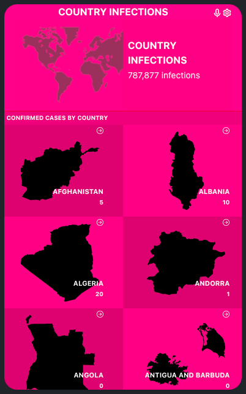
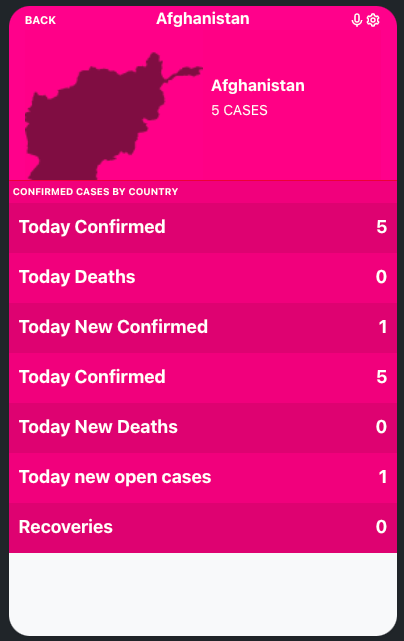

# CORONA VIRUS COUNTRY TRACKER

> A simple project implemented in React JS and Redux for state management to track number of corona active cases, recoveries and deaths across all the countries in the world.




Project created using `create-react-app` and implementing `react-redux` to retreive information from the Corona Tracking Project. Please credits below

## Built With

- HTMl, CSS, JavaScript, React-Bootstrap.
- React.
- Redux.

## Live Demo

[Live Demo Link](https://rtonata88-covid-tracking.netlify.app)


## Getting Started

To get a local copy up and running follow these simple example steps.

### Prerequisites
* A functional computer with VS Code or any functional coding software.
* Git bash or any version control software.

### Setup
* Copy the repo link and clone it in your local machine
* You can execute the following command in your git bash:
    ```` 
    git clone https://github.com/rtonata88/covid-tracer.git
    ````

### Install
* In your consle, run the following command to install the required dependencies:
    ````
    npm install
    ````


### Usage
* You can build the files using React scripts to generate a `/build` folder with distribution files:
    ````
    npm run build
    ````
* Run React server to see the webpage working:
    ````
    npm start
    ````
* You can also open the [Netlify deployment](https://rtonata88-covid-tracking.netlify.app) to see a live version of the webpage.


## Authors


👤 **Richard Tonata**

- GitHub: [@rtonata88](https://github.com/rtonata88)
- Twitter: [@rtonata](https://twitter.com/rtonata)
- LinkedIn: [Richard Tonata](https://www.linkedin.com/in/richard-chambula-49198425/)

## Acknowledgements

* <a href="https://www.flaticon.com/free-icons/planet" title="planet icons">Planet icons created by Freepik - Flaticon</a>
* Rockets, missions, pictures, and descriptions are provided by [SpaceXdata](https://docs.spacexdata.com/)

## 🤝 Contributing

Contributions, issues, and feature requests are welcome!

Feel free to check the [issues page](../../issues/).

## Show your support

Give a ⭐️ if you like this project!

## License and Attributions
This work is licensed under a [Creative Commons Attribution-NonCommercial 4.0 International License](http://creativecommons.org/licenses/by-nc/4.0/)
## API Provisioning
The API data has been provided by [Narrativa API](https://covid19tracking.narrativa.com/index_en.html)

## Acknowledgements
Original design idea by [Nelson Sakwa on Behance](https://www.behance.net/sakwadesignstudio)
